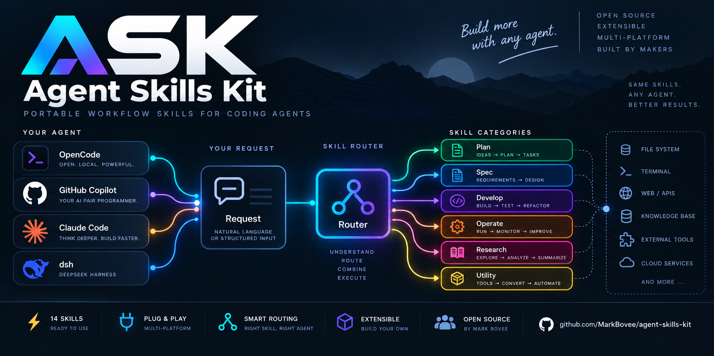
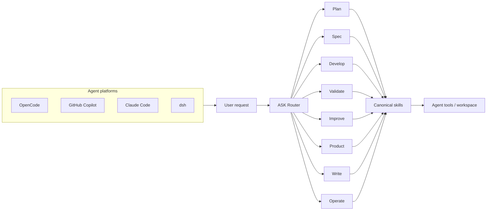
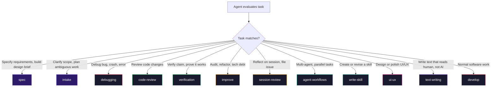

<p align="center">
  
</p>

<p align="center">
  <strong>ASK — Agent Skills Kit.</strong><br />
  Portable workflow skills and routing support for coding agents. One canonical skill system for OpenCode, GitHub Copilot, Claude Code, and DeepSeek Harness (dsh).
</p>

<p align="center">
  
  
  
  
</p>

<p align="center">
  
  
  
</p>

<p align="center">
  <code>ASK</code>
  <code>14 skills</code>
  <code>1 router</code>
  <code>4 agent platforms</code>
  <code>review + verification</code>
</p>

<p align="center">
  <a href="#install">Install</a> •
  <a href="#architecture">Architecture</a> •
  <a href="#skills">Skills</a> •
  <a href="#workflow-model">Workflow</a> •
  <a href="#router">Router</a> •
  <a href="#maintenance">Maintenance</a> •
  <a href="#repo-map">Repo Map</a> •
  <a href="./CHANGELOG.md">Changelog</a>
</p>

---

## Overview

**ASK** (Agent Skills Kit) keeps workflow skills and routing support in one canonical, platform-portable repository.

| Signal               | What it means                                                                                         |
| -------------------- | ----------------------------------------------------------------------------------------------------- |
| One canonical source | Skills live once under `skills/` and export into native platform formats.                             |
| Multi-platform       | The same skill system works across OpenCode, GitHub Copilot, Claude Code, and dsh.                    |
| Smart routing        | The router helps the agent select the right skill for the current task without taking over execution. |
| Develop by default   | Normal software work starts with steady iterative progress, not heavyweight process.                  |
| Hints only           | Router suggests skills. It does not rewrite commands, auto-run tools, or hijack sessions.             |

## Design Goals

* Sharpen workflow routing without building a monolithic prompt constitution.
* Treat implementation, debugging, review, verification, and wrap-up as explicit, intentional stages.
* Ship portable workflow guidance from a single repository to multiple agent platforms.
* Require proof that matches the claim — not ritual for its own sake.

Project changes are tracked in [CHANGELOG.md](./CHANGELOG.md).

Stable installs resolve the latest `vX.Y.Z` tag before copying managed assets. The bootstrap entrypoints are fetched from `main`, but the managed checkout prefers the newest stable tag and only falls back to the current checkout when no stable tag exists yet.

---

## Architecture

ASK separates **where the agent runs** from **what the agent needs to do**.



The platform layer provides the agent runtime. The request enters the shared router, the agent selects the appropriate workflow skill, and the skill guides execution against the available tools and workspace.

The routing groups map to the current skill pack:

| Group          | Skills                           | Purpose                                                                          |
| -------------- | -------------------------------- | -------------------------------------------------------------------------------- |
| **Plan**       | `intake`                         | Explore the problem, clarify scope, and shape multi-phase work before execution. |
| **Spec**       | `spec`                           | Turn requirements into a validated, traceable specification.                     |
| **Develop**    | `develop`, `debugging`           | Implement normal software changes and investigate failures.                      |
| **Validate**   | `code-review`, `verification`    | Review changes and prove completion claims.                                      |
| **Improve**    | `improve`, `session-review`      | Audit, refactor, and improve the workflow itself.                                |
| **Product**    | `ui-ux`, `design-review`         | Design interfaces and filter them before shipping.                               |
| **Write**      | `text-writing`                   | Produce human-first written output.                                              |
| **Operate**    | `gh-inbox`                       | Triage and maintain the repository's GitHub workflow.                            |
| **Coordinate** | `agent-workflows`, `write-skill` | Coordinate agents and maintain or extend the skill system.                       |

The important boundary is:

**same skills, any agent; different skills, different tasks.**

---

## Install

The bootstrap script is the recommended path. It clones if needed, moves the managed checkout to the latest stable tag, installs managed assets, and stays safe to rerun.

### Unified Installer

The managed installer now does one thing: install all shared skills into `~/.agents/skills`, install Copilot instructions and prompt files, install the OpenCode router/plugin and slash commands, when `~/.claude/` already exists write Claude rules and link `~/.claude/skills` back to `~/.agents/skills`, and when dsh is present install the dsh-optimized skill variant into `~/.dsh/skills` plus routing guidance into `~/.dsh/AGENTS.md`.

If you want non-default locations, set environment variables before running the installer:

* `AGENTS_DIR`
* `COPILOT_DIR`
* `OPENCODE_DIR`
* `CLAUDE_DIR`
* `DSH_HOME`

### Bootstrap

**Linux / macOS — Bash:**

```bash
curl -fsSL https://raw.githubusercontent.com/MarkBovee/agent-skills-kit/main/scripts/bootstrap.sh | bash
```

**Windows — PowerShell:**

```powershell
irm https://raw.githubusercontent.com/MarkBovee/agent-skills-kit/main/scripts/bootstrap.ps1 | iex
```

<details>
<summary><strong>Detailed install paths and local-clone commands</strong></summary>

Local clone install:

**Linux / macOS — Bash:**

```bash
gh repo clone MarkBovee/agent-skills-kit
cd agent-skills-kit
bash ./scripts/install.sh
```

**Windows — PowerShell:**

```powershell
pwsh -NoLogo -NoProfile -File .\scripts\install.ps1
```

### OpenCode Details

Manual install copies:

* all folders under `~/.agents/skills/`
* `core/router-core.js`
* `plugins/agent-skills-router.mjs`

Common OpenCode config locations:

| Platform            | Path                      |
| ------------------- | ------------------------- |
| macOS / Linux / WSL | `~/.config/opencode/`     |
| Windows PowerShell  | `$HOME\.config\opencode\` |

Custom roots use the unified installer via environment variables instead of platform-specific positional arguments.

### GitHub Copilot Details

Installed paths:

* `~/.agents/skills/`
* `~/.copilot/instructions/`

VS Code / Copilot now consumes the shared skill root from `~/.agents/skills/`. The Copilot-specific part that remains native is `~/.copilot/instructions/`.

The repository also ships a VS Code Agent Plugin under `.claude-plugin/`, with native skills under `skills/` and lifecycle hooks under `hooks/`. Install it from the GitHub repository through `Chat: Install Plugin From Source`, or register a local checkout with `chat.pluginLocations`:

```json
{
  "chat.pluginLocations": {
    "/path/to/agent-skills-kit": true
  }
}
```

Native Agent Skills perform the automatic relevance-based loading. The plugin manifest and hooks are maintained source assets; `scripts/validate-plugin.js` checks their contract and version alignment. The plugin hooks only add compact session guidance and non-blocking prompt hints; they do not execute skills, rewrite commands, or approve tools. The `SessionStart` hook also surfaces the same cost-aware execution-profile hint described under [Router](#router), and the `UserPromptSubmit` hook recomputes it per prompt (it does not yet track code-edit state across calls the way the OpenCode plugin does, since no post-tool-execution hook event is wired here). Hooks are preview functionality in VS Code. Inspect loaded skills in Agent Customizations and hook activity in Agent Debug Logs.

### Claude Code Details

Installed paths:

* `~/.agents/skills/`
* `~/.claude/rules/`

If `~/.claude/` exists, the installer writes Claude rules under `~/.claude/rules/` and links `~/.claude/skills` back to `~/.agents/skills`.

If `~/.claude/` does not exist, Claude-specific setup is skipped on purpose. Create the directory first if you want the installer to wire Claude into the shared `~/.agents/skills` root.

### DeepSeek Harness (dsh) Details

dsh (DeepSeek Harness) is a Cordis-based "everything is a plugin" agent harness. The kit works **without any dsh plugin**: dsh loads `SKILL.md` bundles natively from ranked skill roots, and its `skill` tool + catalog (`<available_skills>` in the session system prompt) already implements the kit's self-selection routing model. On top of that baseline, an **optional** agent preset (`ask-kit`) adds the OpenCode router's decision-tree injection and per-session state tracking to sessions that select it.

Installed paths (when dsh is present — a reachable `dsh` binary or an existing dsh home):

* `~/.dsh/skills/` — dsh-optimized skill variant (frontmatter `name` + trigger-augmented `description` capped at the dsh catalog limit, plus `whenToUse`)
* `~/.dsh/AGENTS.md` — always-on routing guidance, appended once behind a `<!-- agent-skills-kit:dsh -->` marker (never rewrites existing content)
* `~/.dsh/.agent-presets/ask-kit/` — optional agent preset: a one-time copy of the deployed `standard` preset plus this kit's managed router row (`plugins/ask-kit-router.mjs`, `vendor/router-core.js`)
* `~/.dsh/.agent-skills-kit-dsh-install.txt` — install metadata

#### dsh router preset (optional)

The `ask-kit` preset mounts `plugins/agent-skills-router.dsh.mjs` as a Cordis row. Per model step it appends an `--- Agent Skills Kit ---` section built from `routingHintLines()` in `core/router-core.js` (no decision-tree copy can drift), tracks which skills each session loaded, flags review debt after `edit`/`write`/`apply_patch`, and clears nudges on completion phrases — mirroring `plugins/agent-skills-router.mjs`. It also registers one slash command per skill (`/spec`, `/debugging`, …) through dsh's command registry: picking one steers the session with a load-the-skill prompt following the platform command-file pattern (per-workflow specifics stay in the skill body), with the typed remainder as focus. Row config: `blockUntilSkillLoaded: true` reproduces the OpenCode blocked-tool gate (bash/edit/write denied until a skill loads); it defaults to `false`.

Reinstall refreshes only the managed files (`plugins/ask-kit-router.mjs`, `vendor/router-core.js`); the copied composition, the appended router row, and any edits you made are left alone — delete `~/.dsh/.agent-presets/ask-kit/` and reinstall to rebase on the current `standard` preset or re-add a removed row. Select the preset per session from dsh's picker; removing the directory removes it from the roster.

dsh also loads the canonical shared skills from `~/.agents/skills/` (rank 500); the generated variant installed to `~/.dsh/skills/` (rank 400) shadows them for dsh sessions, so the trigger-augmented descriptions win. dsh discovers the generated `.dsh/skills/` in this repository as project-scoped skills (rank 100) when a session runs inside the kit checkout.

dsh skill roots and ranks (preview, see API exposure below): `<project>/.dsh/skills` (100) → `<project>/.agents/skills` (200) → configured `customSkillDirs` (300) → `~/.dsh/skills` (400) → `~/.agents/skills` (500).

#### dsh preview API exposure

Everything dsh-related is `0.1.0-rc.x` developer preview and can change without notice. The kit's dsh support depends on:

| Surface                       | What the kit relies on                                                                                                               | Break risk                                                                                |
| ----------------------------- | ------------------------------------------------------------------------------------------------------------------------------------ | ----------------------------------------------------------------------------------------- |
| Skill discovery roots & ranks | `~/.dsh/skills` (400) and `~/.agents/skills` (500) discovery, project `.dsh/skills` (100)                                            | Path or rank changes silently change which variant loads                                  |
| Skill frontmatter contract    | `name` (kebab-case) + `description`; optional `whenToUse`; unknown fields (e.g. `triggers`) tolerated                                | A stricter validator could reject unknown fields                                          |
| Catalog rendering             | `name` + `description` only, `catalogDescriptionMaxLength` default 500                                                               | Description truncation; if `whenToUse` starts rendering, descriptions may read duplicated |
| `agent-instructions`          | `~/.dsh/AGENTS.md` user-global candidate, project `AGENTS.md`/`CLAUDE.md` candidates, per-directory content dedup, `maxBytes` budget | Candidate-name changes or dedup changes alter which guidance loads                        |
| Skill registry (`ctx.skills`) | `registerProvider`/`snapshot`/`list`/`get`, duplicate-name shadowing across layers                                                   | API churn in the registry contract                                                        |
| MCP bridge (`dsh-mcp-client`) | Not used by the kit (tools only; skills are not MCP)                                                                                 | n/a                                                                                       |

After a dsh update, the cheap check is a fresh session: the `<available_skills>` catalog should list all fourteen skills and `skill(name: '...')` should load a body; typing `/` in the composer should offer the kit's slash commands when the ask-kit preset is selected.

### Shared Root Policy

Skills are now centralized in `~/.agents/skills/`. The remaining editor-specific surfaces are:

* VS Code / Copilot still uses `~/.copilot/instructions/` for user instructions
* Claude Code still uses `~/.claude/CLAUDE.md` and `~/.claude/rules/` for instructions and rules
* OpenCode still uses its own config/plugin surfaces under `~/.config/opencode/`
* dsh uses `~/.dsh/skills/` for its optimized skill variant and `~/.dsh/AGENTS.md` for routing guidance

The unified installer removes old managed skill copies from editor-specific skill directories so `~/.agents/skills/` becomes the single managed source of truth.

</details>

---

## Skills

Skills use short display names (e.g. `debugging`, `develop`) for easy reference. The `ask-` prefix remains in directory names for namespace isolation.

### By Stage

| Stage      | Skills                           | Purpose                                                                                                  |
| ---------- | -------------------------------- | -------------------------------------------------------------------------------------------------------- |
| Start      | `spec`, `intake`                 | formalize requirements into a validated traceable spec; clarify fuzzy work before it gets expensive      |
| Execute    | `develop`, `debugging`           | move code forward with small coherent loops                                                              |
| Validate   | `code-review`, `verification`    | review the diff and prove the claim (includes workspace wrap-up)                                         |
| Improve    | `improve`, `session-review`      | audit, refactor, session review, skill improvement                                                       |
| Coordinate | `agent-workflows`, `write-skill` | route work, finish cleanly, keep the skill system healthy                                                |
| Product    | `ui-ux`, `design-review`         | push interface work beyond bland default SaaS output, then filter it for AI-default slop before shipping |
| Write      | `text-writing`                   | produce human-sounding text without detectable AI writing patterns                                       |
| Operate    | `gh-inbox`                       | triage the current repository's GitHub issues and discussions, reply when clear, persist inbox state     |

### Full Roster

| Skill             | Tier     | Purpose                                                                                             |
| ----------------- | -------- | --------------------------------------------------------------------------------------------------- |
| `spec`            | standard | Requirements specification + validation gates (Capture → Structure → Validate → Transfer)           |
| `develop`         | standard | Default baseline: small, safe iterative software work (includes implementation mode selection)      |
| `intake`          | standard | Pre-execution: design exploration, scope clarification, and multi-phase planning                    |
| `debugging`       | standard | Root-cause investigation                                                                            |
| `code-review`     | standard | Engineering review passes                                                                           |
| `verification`    | standard | Validation + workspace wrap-up before claiming completion                                           |
| `improve`         | heavy    | Audit-driven improvement + focused refactoring                                                      |
| `session-review`  | light    | Session self-review + GitHub issue filing                                                           |
| `ui-ux`           | heavy    | UI and UX implementation support                                                                    |
| `design-review`   | standard | Anti-default filter: reviews design, UI, or copy for AI-generated slop before shipping              |
| `text-writing`    | standard | Human-first writing: avoids AI-detected vocabulary, structure, punctuation, and formatting patterns |
| `agent-workflows` | light    | Multi-agent coordination + release chores                                                           |
| `write-skill`     | standard | Skill authoring + workflow improvement tracking                                                     |
| `gh-inbox`        | standard | GitHub issue/discussion triage: fetch, diff against stored state, reply when clear, persist         |

## Commands

Each skill also ships as a slash command. A command loads its skill and applies the workflow — no duplicated instructions, always the current skill body.

| Platform                 | Mechanism                            | Location                                              |
| ------------------------ | ------------------------------------ | ----------------------------------------------------- |
| OpenCode                 | `.md` command files                  | `~/.config/opencode/commands/` (global)               |
| GitHub Copilot / VS Code | prompt files                         | `.github/prompts/*.prompt.md` + `~/.copilot/prompts/` |
| Claude Code              | skills are commands (2026)           | no separate file — `skill` → `/name`                  |
| DeepSeek Harness (dsh)   | registered by the ask-kit preset row | no files — `ctx.commands.register()` at runtime       |

Commands are authored once under `commands/` and exported by `export-platform-skills.js` into `.opencode/commands/` (OpenCode) and `.github/prompts/*.prompt.md` (Copilot/VS Code). Claude Code gets its command surface for free because its skills already act as slash commands. dsh has no file-based command discovery; its picker entries are registered programmatically by the ask-kit router preset (one `ctx.commands.register()` per skill; the handler steers the load-the-skill prompt pattern), so no command files ship for it.

---

## Workflow Model

Default rhythm across the pack:

1. Inspect the next boundary that matters.
2. Create the smallest coherent change.
3. Prove the touched surface with the fastest trustworthy check.
4. Review the diff before claiming victory.
5. Continue until done or blocked for real.

That is why `develop` carries `default: true` in frontmatter. The router uses it as a baseline nudge without overriding a clearly stronger match.

The pack favors fast trustworthy checks, then proportional review and verification before completion claims.

---

## Router

`plugins/agent-skills-router.mjs` presents a **decision tree** every prompt. The agent — not the router — evaluates the task against the tree and loads the matching skill via `skill(name: '...')`. No automated phrase matching, no scoring, no hidden routing.

The decision tree injected every prompt:



| Stage          | Skills                           | Color            |
| -------------- | -------------------------------- | ---------------- |
| **Start**      | `spec`, `intake`                 | `#7C5CFF` purple |
| **Execute**    | `debugging`, `develop`           | `#e94560` red    |
| **Validate**   | `code-review`, `verification`    | `#2ecc71` green  |
| **Improve**    | `improve`, `session-review`      | `#f39c12` orange |
| **Coordinate** | `agent-workflows`, `write-skill` | `#1abc9c` teal   |
| **Product**    | `ui-ux`, `design-review`         | `#e91e8c` pink   |
| **Write**      | `text-writing`                   | `#8b5cf6` violet |
| **Operate**    | `gh-inbox`                       | `#4c9aff` blue   |

Session state tracks code edits, tool usage, and skill-load events. The router nudges when code was edited without review, when a UI was produced (load `design-review`), or when many tools ran without loading any skill — always hint, never force.

### Cost-aware execution profile

Two optional frontmatter fields let a skill declare how expensive its default flow is, so hosts that support cheaper subagents or models can route mechanical work to them instead of the primary agent:

| `execution_tier`     | Suggested `agentTier` | When to use                                                               | Example                                                                                                |
| -------------------- | --------------------- | ------------------------------------------------------------------------- | ------------------------------------------------------------------------------------------------------ |
| `light`              | `mini`                | bounded, mechanical, single-pass work                                     | `session-review`                                                                                       |
| `standard` (default) | `default`             | normal judgment-heavy work                                                | `develop`, `spec`, `intake`, `code-review`, `debugging`, `verification`, `write-skill`, `text-writing` |
| `heavy`              | `high`                | broad or multi-part work, e.g. a full codebase audit or complex UI design | `improve`, `ui-ux`                                                                                     |
| `deep`               | `xhigh`               | analysis-heavy or architectural work                                      | —                                                                                                      |

`delegation_default` (`auto` / `prefer-subagent` / `owner-only`) hints whether the work should default to a subagent when the host supports one. Both fields are read by `buildExecutionProfile` in `core/router-core.js`, which also upgrades the tier when the prompt itself signals light or heavy/deep work (e.g. "version bump" vs. "cross-repo migration"), regardless of which skill matched.

The result is injected as a single line, e.g. `Suggested execution profile: task=light, agent=mini, delegation=prefer-subagent, anchor=session-review.` Treat it as a hint: pick the smallest/cheapest model or subagent class the host offers for `mini`, and escalate to `default`/`high`/`xhigh` only when scope grows or a cheap-first attempt fails. This only nudges routing — it never blocks a tool or forces delegation.

Hard boundaries:

* no command rewriting
* no automatic tool execution
* no session takeover
* no hidden automation

### Provider peak-window warnings

The router detects the active model provider (via `chat.params`) and, once per session, surfaces a one-line warning when the provider's peak window is active:

* **Anthropic / Claude** — weekdays 13:00–19:00 UTC, session limit drains faster.
* **DeepSeek** — 01:00–04:00 or 06:00–10:00 UTC, usage costs 2x.

These are informational hints only — they never block work or force delegation.

---

## Platform Matrix

| Platform               | Ships                                                                                         | Generated assets or install target                                                                                                                                 |
| ---------------------- | --------------------------------------------------------------------------------------------- | ------------------------------------------------------------------------------------------------------------------------------------------------------------------ |
| OpenCode               | router plugin, routing support, bootstrap/install/update tooling                              | installs managed skills plus `core/router-core.js` and `plugins/agent-skills-router.mjs`                                                                           |
| GitHub Copilot         | VS Code Agent Plugin, native skills, lifecycle hooks, generated skills, reusable instructions | `.claude-plugin/plugin.json`, `skills/`, `hooks/hooks.json`, `.github/skills/`, `.github/copilot-instructions.md`, `~/.agents/skills/`, `~/.copilot/instructions/` |
| Claude Code            | generated skills, reusable rules, bootstrap/install/update tooling                            | `.claude/skills/`, `CLAUDE.md`, `~/.claude/skills/`, `~/.claude/rules/`                                                                                            |
| DeepSeek Harness (dsh) | generated skills, routing guidance, optional router agent preset, preview API exposure docs   | `.dsh/skills/`, `~/.dsh/skills/`, `~/.dsh/AGENTS.md`, `~/.dsh/.agent-presets/ask-kit/`                                                                             |

OpenCode remains the reference implementation for routing behavior. GitHub Copilot, Claude Code, and dsh exports and adapters are generated or maintained from the same canonical workflow source.

---

## Maintenance

Regenerate exported platform assets:

```bash
node ./scripts/export-platform-skills.js
```

Check trigger ownership and routing hygiene:

```bash
node ./scripts/check-trigger-overlap.js
```

Validate router nudge behavior (audit, blocked-tool guard, auto-match, review nudges):

```bash
node ./scripts/check-router-nudges.js
```

Validate the VS Code plugin contract:

```bash
node ./scripts/validate-plugin.js
```

Load the router plugin directly:

```bash
node -e "import('./plugins/agent-skills-router.mjs')"
```

Check release metadata before tagging:

```bash
node ./scripts/check-release-readiness.js
node ./scripts/check-release-readiness.js --require-version-entry
bash ./scripts/tag-release.sh --dry-run
```

**Windows — PowerShell:**

```powershell
pwsh -NoLogo -NoProfile -File .\scripts\tag-release.ps1 -DryRun
```

The release-readiness check also fails when shipped install surfaces changed since the latest stable tag but `VERSION` was not bumped above that tag yet.

Issue helper for duplicate checks before filing follow-up work:

```bash
skills/ask-session-review/check-existing-issue.sh "<query>" [owner/repo]
```

<details>
<summary><strong>Update commands</strong></summary>

Bootstrap-managed installs update when you rerun `bootstrap.sh` or `bootstrap.ps1` unless `SKIP_PULL=1` or `-SkipPull` is used.

`SKIP_PULL=1` and `-SkipPull` now skip the remote tag refresh step and reuse the current local checkout state.

Local clone install or update:

**Linux / macOS — Bash:**

```bash
bash ./scripts/install.sh

bash ./scripts/update.sh
bash ./scripts/update.sh --skip-pull
```

**Windows — PowerShell:**

```powershell
pwsh -NoLogo -NoProfile -File .\scripts\install.ps1

pwsh -NoLogo -NoProfile -File .\scripts\update.ps1
pwsh -NoLogo -NoProfile -File .\scripts\update.ps1 -SkipPull
```

The unified installer writes one local metadata file after each run:

* Shared managed root: `~/.agents/.agent-skills-kit-install.txt`

</details>

---

## Releases

* `VERSION` is the canonical repo version.
* `CHANGELOG.md` keeps `Unreleased` plus released version entries.
* Stable bootstrap and update scripts resolve the latest `vX.Y.Z` tag before install.
* Until the first stable tag exists, bootstrap and update scripts fall back to the current checkout and print that fallback.
* User-visible fixes to shipped assets should bump at least the patch version before handoff; bootstrap and update users do not receive the fix until the matching `vX.Y.Z` tag exists.

Suggested release flow:

1. Update `VERSION` with at least a patch bump for any shipped fix.
2. Move finished items from `Unreleased` into `## [x.y.z] - YYYY-MM-DD` in `CHANGELOG.md`.
3. Run `node ./scripts/check-release-readiness.js --require-version-entry`.
4. Run `node ./scripts/export-platform-skills.js` and relevant validation commands.
5. Create the release tag from `VERSION` with `bash ./scripts/tag-release.sh` or `pwsh -NoLogo -NoProfile -File .\scripts\tag-release.ps1`.
6. Add `--push` or `-Push` when you want the current branch and tag pushed to `origin` in one step.

The tag helpers refuse dirty worktrees, require a matching changelog entry, and create an annotated `vX.Y.Z` tag directly from `VERSION`.

GitHub Actions runs the same validation on every push and pull request. A push to `main` that changes `VERSION` or `CHANGELOG.md` automatically validates the release, creates the matching annotated tag, and publishes a GitHub Release using that changelog entry. `workflow_dispatch` can be used to publish the current `VERSION` manually.

---

## Repo Map

```text
skills/                     Canonical workflow skills
.github/skills/             Generated GitHub Copilot export
.claude/skills/             Generated Claude Code export

core/router-core.js         Shared scoring, frontmatter, and session helpers
plugins/agent-skills-router.mjs

scripts/bootstrap.*
scripts/install.*
scripts/update.*
scripts/tag-release.*

VERSION                      Canonical release version
CHANGELOG.md                 Human-readable release history
scripts/check-release-readiness.js
```

---

## Notes

* OpenCode is the routing reference implementation.
* Visual assets live in `assets/social-preview.png`.
* For GitHub repo cards, use `assets/social-preview.png` as the social preview image.
* Restart OpenCode after install or update.
* Bootstrap scripts store a managed checkout in `REPO_DIR` when set. Default path is `XDG_DATA_HOME/agent-skills-kit` when available, otherwise `LOCALAPPDATA\agent-skills-kit` on PowerShell, then `~/.local/share/agent-skills-kit`.
* Stable updates use the newest SemVer tag available in the managed checkout.
* `ui-ux` includes Python scripts and CSV data for design guidance and requires Python `3.8+`.
* Installers overwrite only `agent-skills-kit` managed assets and preserve unrelated user customizations.
* Installers also remove stale managed skills during reinstall or update, including skills retired from the pack.
* The unified installer writes `.agent-skills-kit-install.txt` metadata in the shared `~/.agents/` root.
* Generated platform artifacts are derived output. Edit `skills/*/SKILL.md`, then re-export.

---

## Changelog

For project history, removals, and workflow shifts, see [CHANGELOG.md](./CHANGELOG.md).

---

## License

MIT — see [LICENSE](./LICENSE). Copyright (c) 2026 Mark Bovee.
